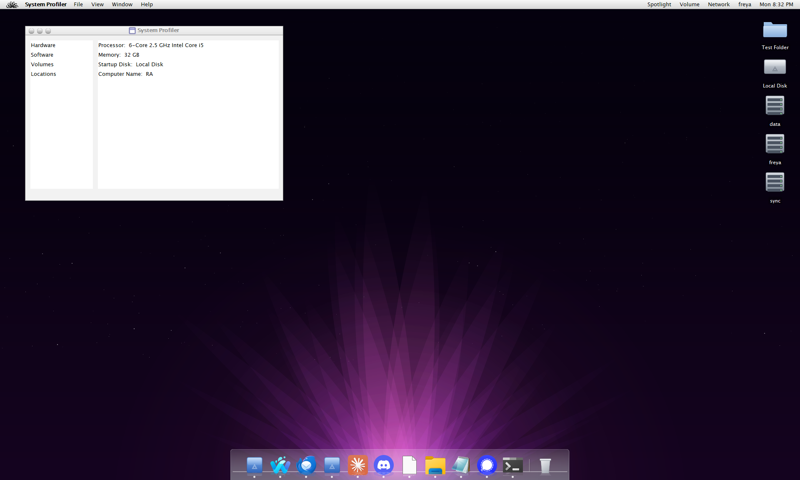

# FractalJDE

A desktop environment for Windows that looks and works like Mac OS X 10.6. The taskbar is
replaced by a menu bar and a Dock, and Explorer by the Finder. It runs alongside Explorer,
and it can take over from it.



*Drawn by the build on a clean machine, which is why the drives are called Windows
and the account is called runneradmin.*

It is written in Java, and it is built like the system it imitates rather than painted to
resemble it. Programs are Mach-O bundles installed on a volume of their own. A dynamic
linker maps them and binds their symbols. An init process starts everything else and keeps
the table of what is running. Each program runs in a process of its own and draws nothing
at all: it describes the window it wants, and the window server puts up real controls.

That last part matters most. What is on screen is a window and not a picture of a window,
so anything can move through it, describe it, or act on it, and a program falling over
takes nothing with it.

## Try it

You need a JDK 21 or newer. Then:

```bash
sh tools/build.sh
java -jar build/FractalJDE.jar
```

The jar starts a small launcher first, which restarts the virtual machine with the flags
the rest of it needs. Started any other way it used to half work, and absorbing that is
what a launcher is for.

Starting takes about a second and a half from nothing to a drawn desktop, and it says where
it has got to as it goes: to the console when there is one, and to a boot screen when there
is not. [booting.md](docs/booting.md) has the whole of it.

`sh tools/release.sh` builds what other people get: a 14K kernel jar and `BaseSystem.dmg`,
a whole system volume in one file. Started, the kernel unpacks the image into `~/.fractaldt`
if there is nothing there yet, then reads the loader off that volume and boots it. Nothing
is compiled or assembled on the machine it is installed on, so what shipped is what runs.

The release also carries `Fractal.exe`, a boot screen and a way to find a Java runtime,
which is the thing to double-click and the thing a Windows `Shell` value would point at. It
is built by `sh tools/launcher.sh` and wants a Rust compiler; without one the release is
built without it and everything else still works.

## What comes with it

Finder, Dock and the menu bar are the desktop. On top of those: TextEdit, Terminal,
Calculator, Activity Monitor, System Profiler and System Preferences. Each is its own
process, started by LaunchServices out of its own bundle.

## Reading further

The rest is in `docs/`, roughly in the order it makes sense to read.

| | |
|---|---|
| [architecture.md](docs/architecture.md) | images, the loader, processes, the task table |
| [booting.md](docs/booting.md) | starting: the order, the boot screen, the process tree |
| [volume.md](docs/volume.md) | the volume, bundles, installing, icons, packaging |
| [types.md](docs/types.md) | what a file is, and how everything finds out |
| [windows.md](docs/windows.md) | the window server, descriptions, the menu bar, the desktop |
| [interfaces.md](docs/interfaces.md) | interface files, and the words in them |
| [panels.md](docs/panels.md) | the save and open panels, and the file browser |
| [programs.md](docs/programs.md) | TextEdit, Calculator, the rest |
| [finder.md](docs/finder.md) | aliases, labels, renaming, shortcuts |
| [dragging.md](docs/dragging.md) | what a drop does, where it can land, what it refuses |
| [text.md](docs/text.md) | the text system, spelling, services |
| [scripting.md](docs/scripting.md) | Apple events, and telling a program what to do |
| [keyboard.md](docs/keyboard.md) | the keys, and what announces itself |
| [aqua.md](docs/aqua.md) | the look, and where it came from |
| [shell.md](docs/shell.md) | taking over from Explorer |

## Source

```
system/     the frameworks and the desktop, one directory per image
apps/       one directory per application, each compiled on its own
tests/      the checks, which are allowed to see everything
tools/      build and packaging, and the launcher, which is the one thing here
            that is not written in Java
```

An application is compiled against the frameworks and never into them, enforced by the
build rather than by good intentions: `apps/Calculator` is given `build/system` on its
class path and nothing else, so it cannot reach into another application, and the
frameworks are compiled before any application exists and so cannot reach into one either.
Where a framework does need a program, it opens it by bundle identifier and talks to it
through `org.fractalmicro.appkit.FMApplicationDelegate`. Nothing in `system/` names a class
in `apps/`.

Everything published for a program to use carries the `FM` prefix, the way everything in
Cocoa carries `NS`: `FMString`, `FMURL`, `FMApplication`, `FMSavePanel`, `FMWorkspace`,
`FMProcessInfo`. Anything without it is the plumbing underneath. That is not a naming
convention but the promise the system makes, because every class an application names is
one that cannot then change without breaking it.

It was not true until recently, and the applications are what showed it. Between them they
named seventeen of this system's classes and only five were published: Activity Monitor
reached into the task table, System Profiler into the file layer, Terminal into the shell.
Cocoa has a name for every one of those questions, so they now have theirs, and
`VocabularyTest` reads the applications on every run and says how many are still reaching
inside. Three, and the list of which is written down.

The images under `system/` are built in the order they depend on each other, so a library
cannot use something above it even by accident. Packages are `org.fractalmicro.*`
throughout, matching the bundle identifiers.

The Finder is one of them and not part of the screen. It was for a long time: AppKit and
the Finder were compiled as one stage, because the Dock opened the Trash by calling into
the file manager, the desktop icons were an AppKit class that called it back, and every
double-click asked it what a file was. They are separate stages now, which is a stronger
statement than a check: AppKit is compiled without the Finder on its class path, so a
reference to it would not build. What opening a file means moved down to LaunchServices,
where it was always a question about programs rather than about windows, and the desktop
icons moved up into the Finder, because a view of a folder belongs to whatever draws
folders. The screen keeps somewhere to put them and is told what goes there.

```
system/LibSystem       win     the Windows calls, the shortcut parser
                       core    logging, the shell, startup items
system/Foundation      foundation  FMString, FMArray, FMDictionary, FMNumber, FMDate,
                                   FMURL, FMData, FMError, FMTask, FMDecimal
                       kernel  the process table, and the table as a service
                       plist   XML and binary property lists
                       fs      files, volumes, Trash, applications, search
                       os      ~/.fractaldt, the preference domains, the system profile
                       xpc     messages, connections, services
                       icns    the icon file reader
                       alias   Finder aliases and Windows shortcuts
system/dyld            dyld    the loader: images, two level binding, runpaths
                       macho   reading and writing Mach-O, the linker, symbol tables
system/launchd         launchd jobs, and Init, which is task 1
system/LaunchServices  bundle  bundles, the images on the volume, and what opening a
                               file means: a program, a folder, or the host
system/Metadata        mds     the search index and its server
system/AppKit          appkit      FMApplication, alerts, sheets, text, services
                       nib         interface descriptions
                       windowserver  the screen, the Dock, the menu bar, the windows
                       theme       colours, fonts, drawn icons, the Swing UI delegates
                       a11y        the dumps, the keyboard test, offscreen rendering
                       menuextras  the clock, volume, network and user indicators
system/Finder          ui      the file manager: its windows, its views, the desktop icons
                       app     the class the system opens it through, by identifier
system/Fractal                 Main and Boot: the session, installed as loginwindow
```

## Checking

Everything below renders offscreen. No window appears, and nothing is sent to the
keyboard or the mouse.

| Flag | What it does |
|---|---|
| `--osascript <script>` | Runs a script against the session that is already up |
| `--selftest` | Opens every window and view, then runs the keyboard and accessibility checks |
| `--dump-accessibility` | Prints the accessibility tree: role, name, states |
| `--native-report` | Prints what the native layer reads from Windows |
| `--screenshot FILE` | Renders the desktop to a PNG |
| `--open PATH` | Opens a Finder window on that folder at start-up |
| `--tasks tree` | Prints what is running, as what started what |

Anything that goes wrong is written to `~/.fractaldt/Users/<user>/Library/Logs/Fractal.log`,
including how many icons the desktop ended up with and what the drive list returned.
Started from `javaw` there is nowhere else for a message to go.

The keyboard check reads focus traversal policies, input maps and action maps: that the
Dock, the window buttons and the toolbar are each a single tab stop, that the arrow
keys and Escape are bound inside them, that the desktop has its own bindings, and that
no two menu items claim the same shortcut. It checks the wiring, not the pressing;
whether Escape actually lands back on the previous control is the one part still worth
trying by hand.

## Comments

A comment says why. What the code does is in the code, and a comment repeating it is one
more thing to keep true.

Length is the part worth being strict about. A long comment is skipped, and a comment
everybody skips is worse than none, because it also hides the ones worth reading. So a
member's doc comment is a line or two, and anything longer belongs at the top of the class,
once, where somebody arriving reads it before anything else.

Two things do not belong in a comment at all. History, which is what the commit that made
the change is for. And restating the name of the thing above it.

There is more of this than the rule allows: `--selftest` counts the doc comments of ten
lines or more and holds the number as a ratchet, so it comes down as files are worked on
and cannot go back up.

## Version

FractalJDE follows semantic versioning. The number lives in `version.properties` and is
bumped per change: patch for a fix, minor for a feature, major for a break. The build
script can do it:

```bash
sh build.sh --bump
sh build.sh --bump minor
sh build.sh --bump major
```

The build number is the moment of the build, written as `yymmddhhmmss` and then in
hexadecimal, so it always rises and stays short: a build at 21:16:49 on 30 August 2026
is 260830211649, which is `3CBAB12E41`. About This Computer shows both, and
`Version.decodeBuild` turns one back into the time it was made. Running straight from
the class files rather than the jar, where nothing has been stamped, the build number is
worked out at start-up.

## Known gaps

- The painting is a lookalike, drawn from the published metrics and from screenshots.
  OpenJDK's own Aqua look and feel could be vendored instead, but it is GPL with the
  classpath exception, which would set the licence of this program; that is a decision
  to make deliberately rather than by accident.
- No drag and drop; use Copy and Paste.
- Desktop icon positions are not remembered, so icons always sit in a grid.
- The sidebar's Devices and Places switches are this program's own keys, not the
  structure the sidebar list format really uses.
- Windows live inside one full screen frame unless the window style setting says
  otherwise, so Windows' Alt Tab usually sees a single application.
- A program in another process can describe a window, its menus, a sheet, and a folder shown
  three ways. What it cannot yet describe is styled text, a path bar, or anything that can
  be dragged. Every application is built and shipped separately, and none of them has a
  main: the bundle names the class and the framework starts it. Only Calculator runs in a
  process of its own; the rest are loaded into the desktop's process out of their own
  bundles, and each moves out as the description protocol grows to carry what it draws.
- The Finder and the Dock are among them, and the Finder is the furthest along: nothing
  above it names a class in it any more, and it is compiled as its own image against
  AppKit. A window shaped like one of its own can now be described in one message, sheets
  and all. What is left is the Finder's own windows using that description instead of
  building themselves, and the parts of them a description still has no words for: the
  path bar, inline renaming, and dragging anything anywhere.
- Burn folders, burning to disc and the clipboard viewer are named but do nothing.
- `Fractal.exe` starts a session and waits for it, and does not start another if that one
  ends. That is fine started by hand and not fine as the Windows shell, where the answer
  to a desktop falling over would be an empty screen until you log out. Setting the shell
  is the step that wants a watchdog first, and it is not done here yet.

## The licence

This is under the Common Development and Distribution License, Version 1.0. The full text
is in [LICENSE](LICENSE), and the header the licence asks for is at the top of every source
file. 236 of them, Java and Rust both, which the self test counts and checks on every run,
because a file without the header is a licensing problem rather than an untidy one.

CDDL is a file-level copyleft licence: those files stay under it, and modifications to them
are returned under it. It is worth being plain about one thing it does not do, since it is
a common hope. **CDDL cannot take in LGPL or GPL code.** Putting this header on someone
else's LGPL source would be relicensing it without permission, and combining the two in one
work is the incompatibility that keeps ZFS out of the Linux kernel. Code can be absorbed
from permissive licences (BSD, MIT, Apache) and not from copyleft ones that are not this
one.

One thing here is not under it. `resources/nvda/` holds the NVDA controller client, three
DLLs and its own LGPL 2.1 text, exactly as NVDA publishes them. They are not modified and
nothing here is derived from them: this program looks the library up at run time and calls
it, which is the use LGPL is written to allow. The licence travels with the files, and the
CDDL header is not applied to them.
