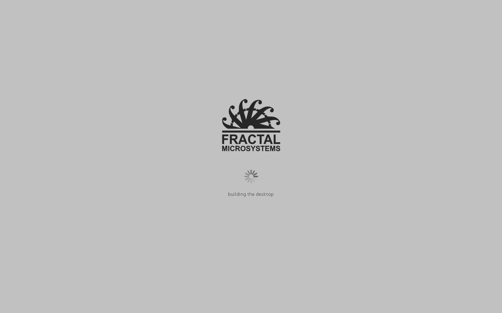

# Starting

From double-clicking something to a desktop: what runs, in what order, and what it says
while it does it.

## The order

```
Fractal.exe or FractalJDE.cmd
  └─ FractalJDE.jar
       └─ Boot            the launcher class: turns the preview flags on
            └─ Kernel     finds the volume, unpacks the image if it has to
                 └─ dyld  the loader, read off the volume
                      └─ launchd, task 1
                           ├─ the jobs on disk        metadata, and whatever else is there
                           └─ loginwindow             a process of its own
                                └─ the desktop        Finder, Dock, the window server
```

Each step is the smallest thing that can do the next. The kernel carries no framework, so
it cannot use one to install a volume; the loader is read off the volume rather than kept
in the kernel, so replacing a system is replacing a file; launchd starts the session in a
process of its own, so the session falling over is not the system falling over.

A cold start, on a machine with nothing installed, is under two seconds to a drawn desktop.

## What it says

Every part of that says where it has got to, in one shape:

```
   0.0  kernel: installing 5.6.0 (3CBEEBFC4C) on C:\Users\freya\.fractaldt
   0.2  kernel: 116 files written
   0.2  kernel: reading the loader
   0.2  kernel: starting sbin/launchd
   0.2  launchd: starting, as task 1
   0.4  launchd: the task table is here
   0.4  launchd: 1 job loaded
   0.4  launchd: the session is task 3, process 21828
   0.7  loginwindow: laying out the volume
   0.9  loginwindow: reading the programs
   0.9  loginwindow: installing the look
   1.1  loginwindow: the desktop folder
   1.2  loginwindow: building the desktop
   1.4  loginwindow: the menu bar
   1.5  loginwindow: ready
```

The number is seconds since the machine started, not since the process printing it did.
Three processes are involved and each one's own clock starts when it does, so measuring
locally would make the times run backwards halfway down. Whoever starts a process passes
the moment on, in `org.fractalmicro.booted`, and
[Progress.java](system/LibSystem/src/org/fractalmicro/core/Progress.java) reads it.

The last line is `ready`, said when the screen is up and has something on it. The disks,
the programs and the Trash count arrive after that and fill themselves in, so waiting for
them would be waiting over a desktop somebody could already use.

These lines are also a profile of the start, which is how the eight seconds came out of
it. Registering a task asks the task table for a number and then tells it what started,
and when there was no table both of those waited two seconds to find that out. The session
registers the Finder and the Dock before it draws anything, so that was eight seconds of
every start where the table was not there, spent finding out nothing was listening.
`TaskServer` looks for the name now instead of connecting to it: connecting waits on
purpose, because a service asked for a moment after it was started has not finished
claiming its name, and that is a different question from whether anything is there now.

## Two ways in

Both start the same thing.

**`FractalJDE.cmd`** runs it in a console window, with `java` rather than `javaw`, so the
narration above is what fills the window. The console is the system console: closing it
stops the system, the way closing a terminal stops what was started from it.

**`Fractal.exe`** is a boot screen. Grey, the company mark, a turning indicator, and the
line the system is on.



*Drawn into a file by the launcher itself, which is the only way to look at a window that
covers the screen.*
 It is a program of its own, in `tools/launcher`, written in Rust
with no dependencies at all, because a launcher exists to be the thing on the machine that
certainly works and every dependency is a way for that to stop being true. Every call it
makes into Windows is declared in [win.rs](tools/launcher/src/win.rs), the same way the
system's own Windows layer declares its.

It reads the narration off the program it started, and takes the screen down when it hears
`ready`. It also takes it down if the program ends, if Escape is pressed, or after three
minutes, because a full screen window over a machine that has stopped is a machine nobody
can use.

Everything it hears goes to `.fractaldt\private\var\log\boot.log`, whether it recognises
the line or not, so a start that went wrong has an account of itself.

```
Fractal.exe --where report.txt     what it found: the jar, the runtime, the log
Fractal.exe --draw picture.bmp     the boot screen, into a file rather than onto the screen
```

The second is how the boot screen gets looked at. It is a full screen window over
everything, so opening it to see whether it looks right takes over the screen of whoever is
looking. Drawn into a file it is the same picture, from the same code, and nothing appears.

### Finding a runtime

In the order somebody would want them tried: `FRACTAL_JAVA` if it is set, a `runtime`
directory beside the launcher, `JAVA_HOME`, the path, and then the registry keys an
installer leaves under `SOFTWARE\JavaSoft`. That last one is the case where Java is on the
machine and nothing on the path knows it, which is most machines.

`javaw.exe` before `java.exe` everywhere, because `java.exe` is a console program and the
console it would want is one a boot screen does not have.

### What it does not do

The narration is in English and does not come from a `.strings` file, unlike everything a
person reads inside the system. It is diagnostic output, in the way a kernel message is:
it goes to a log and a console as often as to a screen, and it is read by a program in
another language that has no bundle to look in and, on a first start, no volume to find one
on. The launcher's own words are two error messages and neither appears on a start that
works.

## The tree

`launchd` is task 1 and everything is descended from it. `--tasks tree` says so:

```
PID    NAME                           KIND         HOST             STATE
0      kernel_task                    system       37108            running
1        launchd                      system       37108            running
2          metadata                   daemon       53828            running
3          loginwindow                system       29480            running
4            Finder                   system       29480            running
5            Dock                     system       29480            running
6            WindowServer             system       29480            running
```

The host column is the number Windows uses. Task 1 and the kernel share a process because
they are the process that started everything; the metadata server and the session are
processes of their own; the Finder, the Dock and the window server are threads inside the
session and say so by sharing its host number.

That last row is the honest part. Being descended from task 1 is not the same as being a
process, and this system has both kinds under it. What makes the numbering worth having is
that a caller asks for a name and never learns which kind answered, so a task can move from
one to the other without anything above it changing. Only Calculator has moved so far. The
rest are threads with numbers, and the tree shows them as threads with numbers rather than
pretending otherwise.

`--tasks` without `tree` prints the same table flat, with a parent column, which is what
`ps` does and what a program reads.

## Replacing the shell

`Fractal.exe` is what a `Shell` value would point at. It waits for what it started rather
than starting it and standing aside, which is what Windows needs from a shell: the process
it watches to know whether anybody is logged in.

Setting it is not done here yet, and [shell.md](shell.md) says why: it is the step that can
lock somebody out of their own machine, and it wants a watchdog and a way back before it
goes near a real account.
